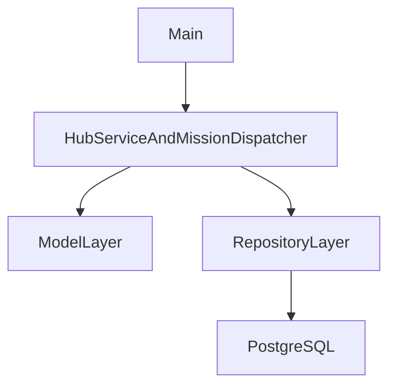

# Galactic Hub Management System

Work in progress (`WIP`): this project is actively evolving, and some roadmap items are still in development.

A Java console application for operating a space hub: docking ships, managing crews and cargo, dispatching missions, and persisting core data in PostgreSQL.

## Implementation Progress

Status guide:
- `[x]` Implemented
- `[ ]` Partial / planned

### Core Requirements Checklist

- [x] Object-oriented domain modeling with encapsulated classes
- [x] Inheritance across ship and cargo hierarchies
- [x] Interface-based behavior (`Fuellable`)
- [x] Multiple collections used across services and domain models (`List`, `Map`, etc.)
- [ ] At least one explicitly sorted collection structure (currently uses sorting logic, but not a dedicated sorted collection as a core store)
- [x] Custom exceptions implemented and used in runtime flows
- [x] Service layer exposing system operations (`HubService`, `MissionDispatcher`)
- [x] Main entry point that drives the application (`Main`)
- [x] Relational persistence integrated (JPA/Hibernate + PostgreSQL)
- [ ] CRUD coverage for at least 6 object types (currently repository-backed for core aggregates, not 6 full CRUD services yet)
- [ ] CSV audit service for executed actions
- [ ] Graphical user interface

### Implemented Features Checklist

- [x] Docking bay lifecycle: create, remove, occupancy-aware operations
- [x] Ship registration and docking/undocking workflows
- [x] Crew onboarding and crew transfer between ships
- [x] Cargo loading with weight checks and hazardous containment validation
- [x] Hazard scan flow for docked ships
- [x] Billing and maintenance simulation (fees, refuel, hull repairs)
- [x] Emergency evacuation flow
- [x] Mission dispatch with event-driven outcomes
- [x] PostgreSQL-backed persistence for ships, bays, and cargo
- [x] Unit and integration tests (including Testcontainers-based DB integration tests)

### TODO's
- [ ] AgriculturalCargo.java, ManufacturedCargo.java, RawMaterialCargo.java need concrete usages. Right now no object of those types are used in the project
- [ ] Finish game logic
- [ ] SpaceShip.java --> calculateFuelCost(int distance): refactor for ship sizes AND different ship types

## Architecture At A Glance

The project is organized around a clear layered flow:

- `model`: entities, value objects, and domain rules
- `service`: operational workflows and business orchestration
- `repository`: data-access abstraction over JPA
- `main`: terminal UI and application bootstrap



Design patterns currently visible:
- Factory: random ship generation via `SpaceShipFactory`
- Builder: ship construction and mission result construction
- Repository: generic `BaseRepository` + concrete repositories

## Tech Stack

- Java 25
- Maven
- JPA (Jakarta Persistence) + Hibernate
- PostgreSQL
- Docker Compose (PostgreSQL + pgAdmin)
- JUnit 6
- Testcontainers
- GitHub Actions CI

## Getting Started

### Prerequisites

- JDK 25
- Maven 3.9+
- Docker Desktop (or Docker Engine + Compose)

### 1) Configure Environment Variables

Create a root `.env` file (for Docker Compose), based on `.env.example`:

```env
POSTGRES_USER=YOUR_USER
POSTGRES_PW=ChangeMe
POSTGRES_DB=DATABASE_NAME
PGADMIN_MAIL=email@email.com
PGADMIN_PW=ADMIN_PASSWD
```

Create a root `.env.persistence` file (for app runtime), based on `.env.persistence.example`:

```env
GALACTIC_DB_USER=YOUR_USER
GALACTIC_DB_PASSWORD=ChangeMe
```

### 2) Start Database Services

```bash
docker compose up -d
```

### 3) Build And Test

```bash
mvn clean package
mvn test
```

### 4) Run The App

Run `com.octavian.galactic.main.Main` from your IDE after the database is running and `.env.persistence` is configured.

## Project Structure

```text
src/
  main/
    java/com/octavian/galactic/
      exception/      # custom runtime exceptions
      main/           # application entry point and terminal flow
      model/          # domain entities and hierarchies
      repository/     # persistence repositories (JPA-based)
      service/        # business operations and mission dispatch
    resources/META-INF/
      persistence.xml # JPA persistence unit configuration
  test/
    java/com/octavian/galactic/
      ...             # unit and integration tests
compose.yaml          # PostgreSQL + pgAdmin services
pom.xml               # build and dependencies
```

## Current Gaps / Next Steps

- [ ] Add an audit service that logs executed actions to CSV (`action_name,timestamp`)
- [ ] Expand full CRUD service coverage to additional object types
- [ ] Add a GUI layer
- [ ] Add ERD documentation for the relational model
- [ ] Harden persistence test coverage for update/delete and edge cases
