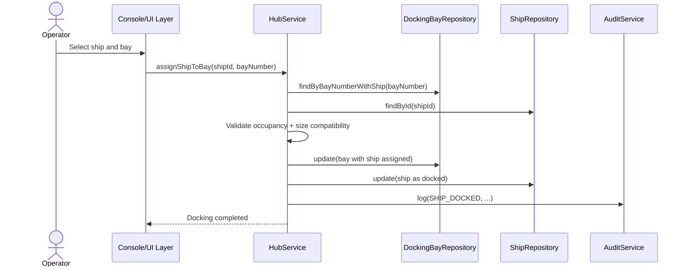
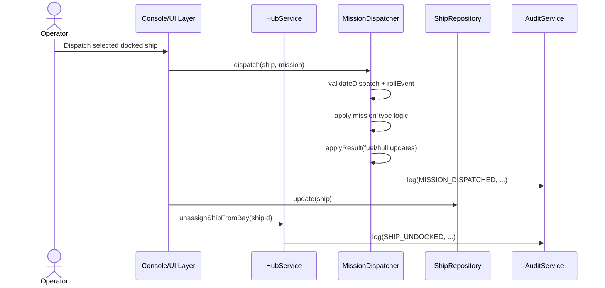
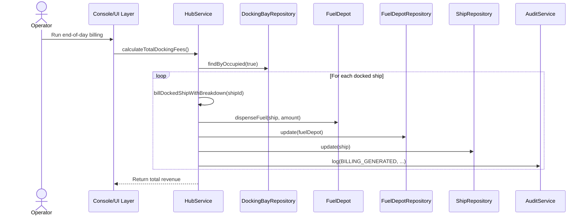
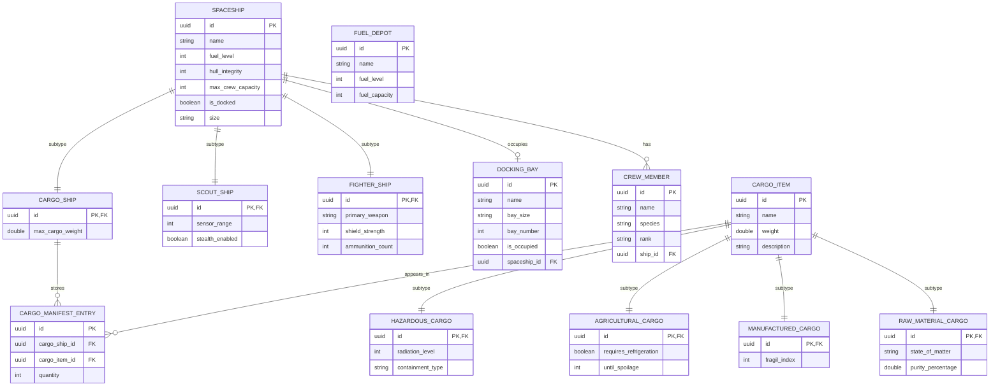

# Galactic Hub Management System - Project Overview

This document is an entry point for understanding what this application does and how it behaves from a business perspective.

It is intentionally written for readers who are new to the project and want to understand:

- why the application exists
- what business operations it supports
- what objects it manages
- what actions can be performed on those objects
- how the persisted data is structured

---

## 1) Business Context

The **Galactic Hub Management System** simulates operations inside a space station hub.

Think of it as an operations console for a station authority that must coordinate:

- docking bay usage
- fleet traffic (arrival/departure)
- crew and cargo handling
- fuel and maintenance services
- mission dispatching and post-mission outcomes
- emergency procedures
- operational audit logging

The core business goal is to keep station activity safe, traceable, and economically sustainable while ships move through the hub.

---

## 2) What The Application Does (At A Glance)

At runtime, the system lets operators:

- register ships and keep a station-wide ship registry
- create/remove docking bays and assign ships to them
- undock ships and free bays
- onboard/transfer crew between docked ships
- load and inspect cargo (including hazardous-material rules)
- scan docked ships for hazardous cargo
- run billing (fueling + repairs + base station fees)
- dispatch missions with event-based outcomes
- trigger station-wide emergency evacuation
- monitor and refill the fuel depot
- generate personnel and cargo-oriented reports

---

## 3) Business Logic Services

### `HubService` (core station operations)

`HubService` is the station's main operational brain. It orchestrates the day-to-day station workflows and enforces key business rules.

Main responsibilities:

- docking bay lifecycle: add/remove bays
- ship lifecycle at station: register, dock, undock
- personnel flows: onboard and transfer crew
- safety checks: hazardous cargo scanning
- finance flows: per-ship and end-of-day billing
- analytics/reporting: personnel report, heaviest cargo ship
- incident handling: emergency evacuation
- fuel depot status support

Key business constraints enforced here:

- ships can dock only in bays that fit their ship size
- occupied bays cannot be removed
- crew transfers require both source and destination ships to be docked
- billing includes class-based multipliers and resource-based charges

### `MissionDispatcher` (mission simulation engine)

`MissionDispatcher` handles dispatch logic for a selected ship and mission:

- validates mission preconditions (especially fuel adequacy)
- rolls a weighted random space event
- applies mission-type logic:
  - `PATROL` favors `FighterShip`
  - `EXPLORE` favors `ScoutShip`
  - `HAUL` favors `CargoShip`
- computes rewards, fuel use, and hull damage
- applies outcomes back to the ship state

This service models "operational uncertainty" in deep-space activity.

### `AuditService` (traceability and accountability)

`AuditService` records major business actions in CSV-formatted logs via the audit logger.

Examples of audited actions:

- bay added/removed
- ship registered/docked/undocked
- crew onboarded/transferred
- cargo loaded
- hazard scan
- mission dispatch
- billing generated
- emergency evacuation
- fuel depot refueled

---

## 4) Core Business Objects And Actions

### `DockingBay`

Represents a physical docking slot in the station.

Allowed actions:

- create bay
- remove bay (only if empty)
- dock ship (if size-compatible and ship is not already docked)
- undock ship
- filter bays by occupied/unoccupied status

### `SpaceShip` (base) and ship specializations

Represents a registered vessel in station operations. Common ship state includes fuel, hull integrity, docking status, size, and crew.

Allowed actions on ships:

- register ship in station registry
- assign ship to bay / unassign from bay
- refuel via depot services
- repair (performed during billing workflow)
- dispatch on mission

Specializations:

- `CargoShip`: carries cargo manifest entries with quantity and weight checks
- `ScoutShip`: exploration-focused, sensor-driven outcomes
- `FighterShip`: combat-focused, weapons/shield mechanics

### `CrewMember`

Represents personnel associated with ships.

Allowed actions:

- onboard crew member to a docked ship
- transfer crew between two docked ships
- remove from ship context (as part of ship-level operations)
- include in personnel reporting

### `CargoItem` and cargo specializations

Represents transportable cargo definitions.

Allowed actions:

- create/persist cargo item definitions
- load cargo into cargo ships with quantity and max-weight checks
- include cargo in manifest and reporting/scan workflows

Specializations:

- `HazardousCargo`: containment/radiation safety checks
- `AgriculturalCargo`: spoilage and refrigeration semantics
- `ManufacturedCargo`: fragility-based handling semantics
- `RawMaterialCargo`: state/purity grading semantics

### `CargoManifestEntry`

Join object connecting a `CargoShip` to a `CargoItem` with a quantity.

Allowed actions:

- create entry when loading a new cargo item onto a ship
- increment quantity when loading an existing manifest item
- query through ship manifest operations

### `FuelDepot`

Represents station fuel inventory.

Allowed actions:

- inspect current reserve and capacity
- dispense fuel to ships (if stock allows)
- restock/refuel the depot

---

## 5) Operational Scenarios (Sequence Diagrams)

### Docking flow

```mermaid
sequenceDiagram
    actor Operator
    participant UI as Console/UI Layer
    participant Hub as HubService
    participant BayRepo as DockingBayRepository
    participant ShipRepo as ShipRepository
    participant Audit as AuditService

    Operator->>UI: Select ship and bay
    UI->>Hub: assignShipToBay(shipId, bayNumber)
    Hub->>BayRepo: findByBayNumberWithShip(bayNumber)
    Hub->>ShipRepo: findById(shipId)
    Hub->>Hub: Validate occupancy + size compatibility
    Hub->>BayRepo: update(bay with ship assigned)
    Hub->>ShipRepo: update(ship as docked)
    Hub->>Audit: log(SHIP_DOCKED, ...)
    Hub-->>UI: Docking completed
```

### Mission dispatch flow

```mermaid
sequenceDiagram
    actor Operator
    participant UI as Console/UI Layer
    participant Hub as HubService
    participant Mission as MissionDispatcher
    participant ShipRepo as ShipRepository
    participant Audit as AuditService

    Operator->>UI: Dispatch selected docked ship
    UI->>Mission: dispatch(ship, mission)
    Mission->>Mission: validateDispatch + rollEvent
    Mission->>Mission: apply mission-type logic
    Mission->>Mission: applyResult(fuel/hull updates)
    Mission->>Audit: log(MISSION_DISPATCHED, ...)
    UI->>ShipRepo: update(ship)
    UI->>Hub: unassignShipFromBay(shipId)
    Hub->>Audit: log(SHIP_UNDOCKED, ...)
```

### End-of-day billing flow

```mermaid
sequenceDiagram
    actor Operator
    participant UI as Console/UI Layer
    participant Hub as HubService
    participant BayRepo as DockingBayRepository
    participant FuelDepot as FuelDepot
    participant FuelRepo as FuelDepotRepository
    participant ShipRepo as ShipRepository
    participant Audit as AuditService

    Operator->>UI: Run end-of-day billing
    UI->>Hub: calculateTotalDockingFees()
    Hub->>BayRepo: findByOccupied(true)
    loop For each docked ship
        Hub->>Hub: billDockedShipWithBreakdown(shipId)
        Hub->>FuelDepot: dispenseFuel(ship, amount)
        Hub->>FuelRepo: update(fuelDepot)
        Hub->>ShipRepo: update(ship)
        Hub->>Audit: log(BILLING_GENERATED, ...)
    end
    Hub-->>UI: Return total revenue
```

---

## 6) Database Entity-Relationship Diagram

The persistence model uses joined inheritance for ships and cargo types, plus association tables for crew assignment and cargo manifests.

```mermaid
erDiagram
    SPACESHIP {
        uuid id PK
        string name
        int fuel_level
        int hull_integrity
        int max_crew_capacity
        boolean is_docked
        string size
    }

    CARGO_SHIP {
        uuid id PK,FK
        double max_cargo_weight
    }

    SCOUT_SHIP {
        uuid id PK,FK
        int sensor_range
        boolean stealth_enabled
    }

    FIGHTER_SHIP {
        uuid id PK,FK
        string primary_weapon
        int shield_strength
        int ammunition_count
    }

    DOCKING_BAY {
        uuid id PK
        string name
        string bay_size
        int bay_number
        boolean is_occupied
        uuid spaceship_id FK
    }

    CREW_MEMBER {
        uuid id PK
        string name
        string species
        string rank
        uuid ship_id FK
    }

    CARGO_ITEM {
        uuid id PK
        string name
        double weight
        string description
    }

    HAZARDOUS_CARGO {
        uuid id PK,FK
        int radiation_level
        string containment_type
    }

    AGRICULTURAL_CARGO {
        uuid id PK,FK
        boolean requires_refrigeration
        int until_spoilage
    }

    MANUFACTURED_CARGO {
        uuid id PK,FK
        int fragil_index
    }

    RAW_MATERIAL_CARGO {
        uuid id PK,FK
        string state_of_matter
        double purity_percentage
    }

    CARGO_MANIFEST_ENTRY {
        uuid id PK
        uuid cargo_ship_id FK
        uuid cargo_item_id FK
        int quantity
    }

    FUEL_DEPOT {
        uuid id PK
        string name
        int fuel_level
        int fuel_capacity
    }

    SPACESHIP ||--o| DOCKING_BAY : occupies
    SPACESHIP ||--o{ CREW_MEMBER : has
    CARGO_SHIP ||--o{ CARGO_MANIFEST_ENTRY : stores
    CARGO_ITEM ||--o{ CARGO_MANIFEST_ENTRY : appears_in

    SPACESHIP ||--|| CARGO_SHIP : subtype
    SPACESHIP ||--|| SCOUT_SHIP : subtype
    SPACESHIP ||--|| FIGHTER_SHIP : subtype

    CARGO_ITEM ||--|| HAZARDOUS_CARGO : subtype
    CARGO_ITEM ||--|| AGRICULTURAL_CARGO : subtype
    CARGO_ITEM ||--|| MANUFACTURED_CARGO : subtype
    CARGO_ITEM ||--|| RAW_MATERIAL_CARGO : subtype
```

---

## 7) Notes About Scope

- Mission data (`Mission`, `MissionResult`) is runtime/business-process data and is not persisted as a database entity.
- The project currently supports both console and JavaFX entry points over the same service/repository core.
- Cargo subtypes beyond `HazardousCargo` are present in the model and persistence structure, but their operational usage is still evolving.

